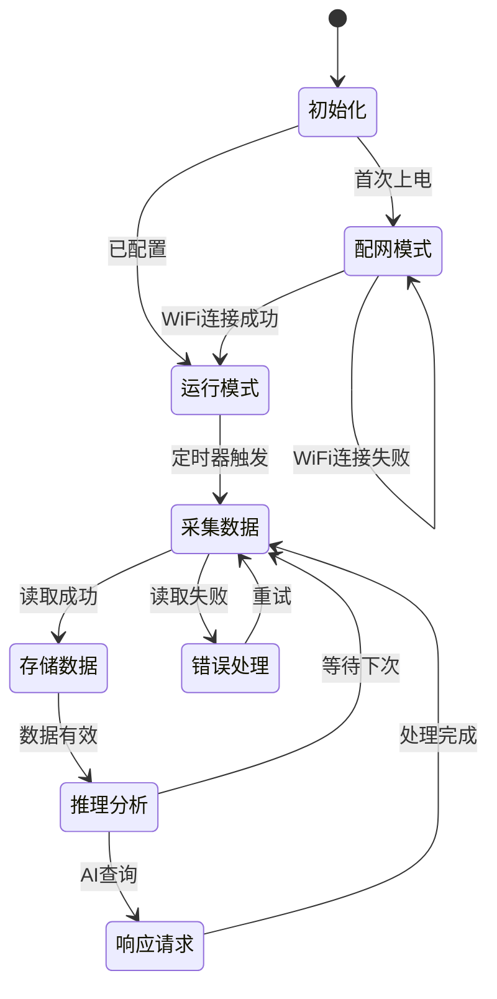

# MindNote 情绪陪伴 AI - 技术架构文档

## 1. 系统架构总览

### 1.1 核心设计理念

```
┌────────────────────────────────────────────────────────────────┐
│  设计原则：本地优先 + 云端增强                                   │
│                                                                │
│  • 本地小模型：快速响应、离线可用、设备控制                       │
│  • 云端大模型：深度对话、情感理解、复杂推理                       │
│  • 混合架构：根据场景智能路由，兼顾体验和成本                     │
└────────────────────────────────────────────────────────────────┘
```

### 1.2 系统架构图

```
┌─────────────────────────────────────────────────────────────────────┐
│                         用户交互层                                   │
│  ┌─────────────────────────────────────────────────────────────┐   │
│  │  🎤 麦克风阵列 ──→ VAD(语音活动检测) ──→ 唤醒词检测           │   │
│  │                              ↓                               │   │
│  │                    ASR (语音识别)                            │   │
│  │                              ↓                               │   │
│  │  🔊 扬声器 ←── TTS (语音合成) ←── AI 响应                    │   │
│  └─────────────────────────────────────────────────────────────┘   │
└─────────────────────────────────────────────────────────────────────┘
                                  │
                                  ▼
┌─────────────────────────────────────────────────────────────────────┐
│                      本地 AI 处理层 (关键！)                         │
│  ┌──────────────────┐  ┌──────────────────┐  ┌─────────────────┐   │
│  │  意图识别模型     │  │  实体提取模型     │  │  情绪分类模型   │   │
│  │  (本地 NLU)      │  │  (本地 NER)       │  │  (本地)        │   │
│  │                  │  │                  │  │                 │   │
│  │  识别用户意图:    │  │  提取关键信息:    │  │  识别情绪:      │   │
│  │  • 设备控制      │  │  • 音量数值       │  │  • 开心/难过    │   │
│  │  • 闲聊对话      │  │  • 亮度数值       │  │  • 焦虑/平静    │   │
│  │  • 查询信息      │  │  • 时间/日期      │  │  • 愤怒/放松    │   │
│  │  • 情绪倾诉      │  │  • 功能名称       │  │                 │   │
│  └──────────────────┘  └──────────────────┘  └─────────────────┘   │
│                                  │                                  │
│                    ┌─────────────┴─────────────┐                   │
│                    ▼                           ▼                   │
│           ┌───────────────┐           ┌───────────────┐            │
│           │  本地快速响应  │           │  云端深度对话  │            │
│           │  (设备控制等)  │           │  (情感陪伴等)  │            │
│           └───────────────┘           └───────────────┘            │
└─────────────────────────────────────────────────────────────────────┘
                                  │
                                  ▼
┌─────────────────────────────────────────────────────────────────────┐
│                         云端 AI 服务层                               │
│  ┌──────────────────┐  ┌──────────────────┐  ┌─────────────────┐   │
│  │  大模型对话 API   │  │  ASR 云服务      │  │  TTS 云服务     │   │
│  │  (Claude/GPT)    │  │  (讯飞/阿里)     │  │  (讯飞/阿里)    │   │
│  └──────────────────┘  └──────────────────┘  └─────────────────┘   │
└─────────────────────────────────────────────────────────────────────┘
                                  │
                                  ▼
┌─────────────────────────────────────────────────────────────────────┐
│                          数据存储层                                  │
│  ┌──────────────────┐  ┌──────────────────┐  ┌─────────────────┐   │
│  │  对话历史        │  │  情绪记录        │  │  用户偏好设置   │   │
│  │  (本地 SQLite)   │  │  (本地 + 云端)   │  │  (本地)        │   │
│  └──────────────────┘  └──────────────────┘  └─────────────────┘   │
└─────────────────────────────────────────────────────────────────────┘
                                  │
                                  ▼
┌─────────────────────────────────────────────────────────────────────┐
│                          硬件控制层                                  │
│  ┌──────────────┐ ┌──────────────┐ ┌──────────────┐ ┌────────────┐ │
│  │ 🔊 音量控制  │ │ 💡 屏幕亮度  │ │ 🌈 灯光效果  │ │ 🌡️ 传感器  │ │
│  └──────────────┘ └──────────────┘ └──────────────┘ └────────────┘ │
└─────────────────────────────────────────────────────────────────────┘
```

### 1.3 技术栈选型
- **主控芯片**: 树莓派 Zero 2W（推荐）或 ESP32-S3
- **语音识别**: 讯飞云端 ASR + 本地 Sherpa-onnx（离线备用）
- **语音合成**: 讯飞云端 TTS + 本地 Piper（简单回复）
- **本地 NLU**: TensorFlow Lite 意图分类模型
- **云端对话**: Claude API / GPT API
- **唤醒词**: Porcupine
- **数据存储**: 本地 SQLite + 云端备份

## 2. 本地小模型方案（核心创新点）

### 2.1 为什么需要本地小模型？

| 场景 | 纯云端方案 | 本地+云端混合方案 |
|------|-----------|------------------|
| "音量调大一点" | 2-3秒延迟，浪费 API 调用 | **<500ms 响应，本地处理** |
| "现在几点了" | 需要联网，API 成本 | **本地即时回答** |
| "屏幕太亮了" | 云端理解后再控制 | **本地直接控制** |
| "我今天好累..." | 需要云端深度理解 | 路由到云端处理 |
| 断网时 | 完全不可用 | **基础功能可用** |

### 2.2 本地意图分类设计

```python
# 本地意图分类（约 20 个意图）
INTENTS = {
    # ===== 设备控制类 - 本地处理，<500ms 响应 =====
    "device_volume_up": ["大声点", "音量调高", "声音大一点", "听不清", "太小声了"],
    "device_volume_down": ["小声点", "音量调低", "声音小一点", "太吵了", "轻一点"],
    "device_volume_set": ["音量调到50", "音量设置为80", "音量30"],
    "device_volume_mute": ["静音", "别出声", "安静"],
    
    "device_brightness_up": ["亮一点", "屏幕太暗", "看不清"],
    "device_brightness_down": ["暗一点", "屏幕太亮", "刺眼", "太亮了"],
    "device_brightness_set": ["亮度调到50", "亮度80"],
    "device_screen_off": ["关闭屏幕", "屏幕关掉"],
    
    "device_light_on": ["开灯", "打开灯光", "把灯打开"],
    "device_light_off": ["关灯", "关闭灯光", "把灯关了"],
    "device_light_color": ["灯光调成蓝色", "换个颜色", "红色灯光", "暖光"],
    "device_light_mode": ["呼吸灯", "彩虹模式", "灯光闪烁"],
    
    # ===== 快速查询类 - 本地处理 =====
    "query_time": ["现在几点", "什么时间", "几点了", "报时"],
    "query_date": ["今天几号", "星期几", "什么日期", "今天周几"],
    "query_weather": ["天气怎么样", "今天热吗", "会下雨吗", "温度多少"],
    "query_environment": ["房间温度", "湿度多少", "现在多少度"],
    
    # ===== 系统控制类 - 本地处理 =====
    "system_stop": ["停", "闭嘴", "别说了", "安静", "停止"],
    "system_repeat": ["再说一遍", "没听清", "什么", "重复一下"],
    "system_cancel": ["取消", "算了", "不用了"],
    "system_help": ["你能做什么", "帮助", "功能介绍"],
    
    # ===== 情感对话类 - 路由到云端 =====
    "chat_emotion": ["我好累", "心情不好", "很开心", "有点焦虑", "难过"],
    "chat_casual": ["聊聊天", "无聊", "陪我说说话", "在吗"],
    "chat_question": ["你觉得呢", "怎么办", "给我建议", "你说呢"],
    "chat_share": ["告诉你一件事", "今天发生了", "你知道吗"],
}
```

### 2.3 本地模型技术选型

#### 方案 A：TensorFlow Lite 分类模型（推荐 MVP）

```
硬件要求：树莓派 Zero 2W (512MB RAM)
模型大小：< 5MB
推理速度：< 50ms

模型架构：
├── 输入：文本 (经过分词)
├── Embedding 层：128 维
├── LSTM/GRU 层：64 单元
├── Dense 层：32 单元
└── 输出：20 个意图分类

训练数据需求：每个意图 100-500 条样本
```

#### 方案 B：DistilBERT 量化版（进阶）

```
硬件要求：树莓派 4B (2GB+ RAM)
模型大小：~60MB (INT8 量化后)
推理速度：100-200ms

优势：
├── 更强的语义理解
├── 更好的泛化能力
└── 可同时做意图+情绪分类
```

### 2.4 实体提取设计

```python
# 从用户输入中提取关键实体
ENTITY_PATTERNS = {
    "number": r"(\d+)",                    # 数字：音量50、亮度80
    "color": r"(红|蓝|绿|黄|白|暖|冷|紫|橙)色?",  # 颜色
    "time_relative": r"(明天|后天|昨天|今天|现在)",
    "percentage": r"(\d+)%",               # 百分比
}

# 示例
# 输入："音量调到60"
# 输出：intent="device_volume_set", entities={"number": 60}

# 输入："灯光调成蓝色"  
# 输出：intent="device_light_color", entities={"color": "蓝"}
```

## 3. 设备控制系统设计

### 3.1 可控制的设备功能

```yaml
设备控制能力:
  音频:
    volume: 0-100          # 音量
    mute: true/false       # 静音
    voice_speed: 0.5-2.0   # 语速
    voice_pitch: 0.5-2.0   # 音调
  
  显示:
    brightness: 0-100      # 屏幕亮度
    screen_on: true/false  # 屏幕开关
    theme: light/dark      # 主题
  
  灯光:
    light_on: true/false   # 灯光开关
    light_color: RGB       # 灯光颜色
    light_mode: breathing/static/rainbow  # 灯光模式
    light_brightness: 0-100  # 灯光亮度
  
  系统:
    do_not_disturb: true/false  # 勿扰模式
    proactive_care: true/false  # 主动关怀开关
    wake_word_sensitivity: 1-10 # 唤醒词灵敏度
```

### 3.2 语音控制示例

```
┌─────────────────────────────────────────────────────────────┐
│  用户说                    │  系统响应                      │
├─────────────────────────────────────────────────────────────┤
│  "音量大一点"              │  音量 +20，"好的"              │
│  "音量调到 50"             │  音量 = 50，"音量已调到50"     │
│  "声音太大了"              │  音量 -30，"好的，小声一点"    │
│  "静音"                    │  静音，"好的"                  │
│  "屏幕太亮了"              │  亮度 -30，"好的"              │
│  "把灯关了"                │  灯光关闭，"好的"              │
│  "灯光调成蓝色"            │  灯光 = 蓝色，"好的"           │
│  "开启勿扰模式"            │  勿扰 = true，"好的，我会安静的"│
│  "现在几点"                │  "现在是下午3点20分"           │
│  "今天天气怎么样"          │  "今天晴，25度，很舒适"        │
│  "房间温度多少"            │  "现在室内温度24度，湿度55%"   │
└─────────────────────────────────────────────────────────────┘
```

### 3.3 设备控制器实现

```python
class DeviceController:
    """设备控制器 - 本地执行，无需云端"""
    
    def __init__(self):
        self.volume = 70
        self.brightness = 80
        self.light_on = True
        self.light_color = (255, 200, 150)  # 暖白
        self.mute = False
        self.do_not_disturb = False
    
    def handle_intent(self, intent: str, entities: dict) -> tuple[str, bool]:
        """
        处理设备控制意图
        返回: (回复文本, 是否需要TTS播放)
        """
        
        if intent == "device_volume_up":
            self.volume = min(100, self.volume + 20)
            self._set_system_volume(self.volume)
            return "好的", True
        
        elif intent == "device_volume_down":
            self.volume = max(0, self.volume - 20)
            self._set_system_volume(self.volume)
            return "好的，小声一点", True
        
        elif intent == "device_volume_set":
            value = entities.get("number", 50)
            self.volume = max(0, min(100, int(value)))
            self._set_system_volume(self.volume)
            return f"音量已调到{self.volume}", True
        
        elif intent == "device_volume_mute":
            self.mute = True
            self._set_system_volume(0)
            return "好的", True
        
        elif intent == "device_brightness_down":
            self.brightness = max(10, self.brightness - 30)
            self._set_screen_brightness(self.brightness)
            return "好的", True
        
        elif intent == "device_brightness_up":
            self.brightness = min(100, self.brightness + 30)
            self._set_screen_brightness(self.brightness)
            return "好的", True
        
        elif intent == "device_light_off":
            self.light_on = False
            self._set_led_light(False)
            return "好的", True
        
        elif intent == "device_light_on":
            self.light_on = True
            self._set_led_light(True, self.light_color)
            return "好的", True
        
        elif intent == "device_light_color":
            color_name = entities.get("color", "白")
            self.light_color = self._color_name_to_rgb(color_name)
            self._set_led_light(True, self.light_color)
            return f"好的，已切换到{color_name}色", True
        
        elif intent == "system_stop":
            # 立即停止当前播放
            self._stop_audio()
            return "", False  # 不需要回复
        
        return None, False  # 未处理的意图
    
    def _color_name_to_rgb(self, name: str) -> tuple:
        COLOR_MAP = {
            "红": (255, 0, 0),
            "蓝": (0, 0, 255),
            "绿": (0, 255, 0),
            "黄": (255, 255, 0),
            "白": (255, 255, 255),
            "暖": (255, 200, 150),
            "冷": (200, 220, 255),
            "紫": (128, 0, 128),
            "橙": (255, 165, 0),
        }
        return COLOR_MAP.get(name, (255, 255, 255))
```

## 4. 语音交互技术栈

### 4.1 语音识别 (ASR) 方案对比

| 方案 | 延迟 | 准确率 | 成本 | 离线 | 推荐场景 |
|------|------|--------|------|------|----------|
| **讯飞云端** | 300-500ms | 98% | ¥0.005/次 | ❌ | MVP 首选 |
| **阿里云端** | 300-500ms | 97% | ¥0.004/次 | ❌ | 备选 |
| **Whisper 本地** | 1-3s | 95% | 免费 | ✅ | 树莓派4B |
| **Sherpa-onnx** | 200-500ms | 93% | 免费 | ✅ | 离线备用 |

**推荐**：讯飞云端 ASR（主）+ Sherpa-onnx（离线备用）

### 4.2 语音合成 (TTS) 方案对比

| 方案 | 延迟 | 音质 | 成本 | 离线 | 情感 |
|------|------|------|------|------|------|
| **讯飞云端** | 200-400ms | 优秀 | ¥0.002/字 | ❌ | 支持 |
| **Edge TTS** | 300-500ms | 良好 | 免费 | ❌ | 有限 |
| **Piper 本地** | 100-300ms | 良好 | 免费 | ✅ | 有限 |

**推荐**：
- 情感对话：讯飞云端 TTS（音质好）
- 设备控制回复：Piper 本地 TTS（快速）

### 4.3 唤醒词检测

| 方案 | 功耗 | 准确率 | 自定义 | 推荐 |
|------|------|--------|--------|------|
| **Porcupine** | 极低 | 98% | 付费 | ✅ MVP |
| **Snowboy** | 低 | 95% | 免费 | 备选 |

## 5. 对话处理流程

### 5.1 完整流程图

```
用户说话
    │
    ▼
┌─────────────────┐
│  唤醒词检测      │ ← Porcupine，持续监听
│  "小心"/"Hey Mind" │
└─────────────────┘
    │ 唤醒成功
    ▼
┌─────────────────┐
│  语音活动检测    │ ← VAD，检测说话开始/结束
│  (VAD)          │
└─────────────────┘
    │ 录音完成
    ▼
┌─────────────────┐
│  语音识别 (ASR)  │ ← 云端讯飞 / 本地 Sherpa
└─────────────────┘
    │ 文本结果
    ▼
┌─────────────────┐
│  本地意图识别    │ ← TFLite 模型，<50ms
│  (NLU)          │
└─────────────────┘
    │
    ├─── 设备控制意图 ───→ 本地执行 → 本地 TTS
    │                      "好的" (<500ms)
    │
    ├─── 快速查询意图 ───→ 本地查询 → 本地 TTS
    │                      "现在3点20分" (<500ms)
    │
    └─── 情感/复杂意图 ──→ 云端大模型 → 云端 TTS
                          深度对话 (1-3s)
```

### 5.2 响应时间目标

| 场景 | 目标 | 实现方式 |
|------|------|----------|
| 设备控制 | <500ms | 本地 NLU + 本地 TTS |
| 时间/日期查询 | <500ms | 本地 NLU + 本地 TTS |
| 天气查询 | <1s | 本地 NLU + 缓存数据 |
| 情感对话 | <2s | 云端 ASR + 云端 LLM |
| 复杂问答 | <3s | 云端全链路 |

## 6. 开放接口设计（未来）

### 6.1 本地 REST API

```yaml
# 供 App 和局域网设备调用
endpoints:
  GET /api/status           # 设备状态
  POST /api/device/volume   # 音量控制
  POST /api/device/brightness  # 亮度控制
  POST /api/device/light    # 灯光控制
  POST /api/chat            # 发送对话
  GET /api/emotions         # 情绪记录
```

### 6.2 MCP Server（未来）

```typescript
// 供 Claude Desktop 等 AI 助手调用
tools:
  - get_user_emotion_status    // 获取用户情绪状态
  - get_emotion_history        // 获取情绪历史
  - send_message_to_device     // 让设备说话
  - get_environment_data       // 获取环境数据
```

## 7. 旧版 MCP 工具设计（参考）

> 以下为旧版设计，保留作为开放接口的参考

### 7.1 emotion-monitor-mcp
**功能描述**: 环境数据采集与监测

**工具接口**:
```typescript
interface EmotionMonitorMCP {
  // 获取当前环境数据
  get_current_environment(): Promise<{
    indoor: {
      temperature: number;    // ℃
      humidity: number;       // %
      light_level: number;    // lux
      timestamp: string;      // ISO时间
    };
    outdoor: {
      weather: string;        // 天气状况
      weather_code: number;   // 天气代码
      temperature: number;    // ℃
      humidity: number;       // %
      wind_speed: number;     // m/s
    };
  }>;

  // 获取历史环境数据
  get_environment_history(
    start_date: string,  // YYYY-MM-DD
    end_date: string     // YYYY-MM-DD
  ): Promise<Array<{
    timestamp: string;
    temperature: number;
    humidity: number;
    light_level: number;
  }>>;
}
```

### 7.2 diary-record-mcp
**功能描述**: 情绪日记记录与管理

**工具接口**:
```typescript
interface DiaryRecordMCP {
  // 记录情绪日记条目
  record_emotion_diary(
    mood_score: number,      // 1-10分
    mood_tags: string[],     // 情绪标签数组
    environment_data?: object, // 环境数据（可选）
    note?: string           // 用户备注（可选）
  ): Promise<{ success: boolean; diary_id: string; message: string }>;

  // 获取情绪日记数据
  get_emotion_diary(
    start_date: string,     // YYYY-MM-DD
    end_date: string,       // YYYY-MM-DD
    limit?: number          // 限制返回条数（可选）
  ): Promise<Array<{
    diary_id: string;
    timestamp: string;
    mood_score: number;
    mood_tags: string[];
    environment_data: object;
    note: string;
  }>>;
}
```

### 7.3 insight-generator-mcp
**功能描述**: 基于日记数据生成情绪洞察报告

**工具接口**:
```typescript
interface InsightGeneratorMCP {
  // 获取情绪洞察报告
  get_emotion_insights(
    start_date: string,  // YYYY-MM-DD
    end_date: string     // YYYY-MM-DD
  ): Promise<{
    period: string;
    average_mood: number;      // 平均情绪评分
    mood_trend: 'improving' | 'stable' | 'declining';
    top_mood_tags: string[];   // 最常见的情绪标签
    environment_correlations: Array<{
      factor: string;          // 影响因素（如温度、湿度等）
      correlation: number;     // 相关性系数 (-1 到 1)
      description: string;
    }>;
    improvement_suggestions: string[];  // 改善建议
    positive_reinforcements: string[];  // 表扬和鼓励内容
    data_quality: 'good' | 'fair' | 'poor';
  }>;

  // 生成趋势分析
  get_trend_analysis(
    period: 'week' | 'month' | 'quarter'
  ): Promise<{
    period: string;
    mood_trend: 'improving' | 'stable' | 'declining';
    key_insights: string[];
    correlation_findings: Array<{
      factor: string;
      correlation: number;    // -1 到 1
      description: string;
    }>;
    recommendations: string[];
    positive_highlights: string[];  // 积极亮点
  }>;

  // 导出数据
  export_data(
    start_date: string,
    end_date: string,
    format: 'json' | 'csv'
  ): Promise<{
    download_url: string;
    expires_at: string;
  }>;
}
```

## 3. MCP工具实现状态

### 3.1 实现概述
所有三个MCP工具均已使用JavaScript/Node.js实现，部署在独立的服务器上：

- **emotion-monitor-mcp**: 运行在端口3001
- **diary-record-mcp**: 运行在端口3000
- **insight-generator-mcp**: 运行在端口3002

### 3.2 技术栈
- **运行环境**: Node.js
- **Web框架**: Express.js
- **协议**: MCP (Model Context Protocol)
- **数据格式**: JSON

### 3.3 部署架构
```
┌─────────────────────────────────────────────────────────────┐
│                        用户层                                │
│  ┌──────────────┐  ┌──────────────┐  ┌──────────────┐      │
│  │   AI助手     │  │   Web界面    │  │   移动端APP  │      │
│  │  (MCP客户端) │  │              │  │              │      │
│  └──────────────┘  └──────────────┘  └──────────────┘      │
└─────────────────────────────────────────────────────────────┘
                              │
                              │ MCP Protocol
                              ▼
┌─────────────────────────────────────────────────────────────┐
│                      MCP工具层                               │
│  ┌──────────────┐  ┌──────────────┐  ┌──────────────┐      │
│  │emotion-      │  │diary-        │  │insight-      │      │
│  │monitor-mcp   │  │record-mcp    │  │generator-mcp │      │
│  │(端口:3001)   │  │(端口:3000)   │  │(端口:3002)   │      │
│  └──────────────┘  └──────────────┘  └──────────────┘      │
└─────────────────────────────────────────────────────────────┘
                              │
                              │ Internal APIs
                              ▼
┌─────────────────────────────────────────────────────────────┐
│                     硬件抽象层                               │
│  ┌──────────────┐  ┌──────────────┐  ┌──────────────┐      │
│  │  传感器接口   │  │   WiFi模块   │  │   存储模块   │      │
│  │ (温湿度/光线) │  │             │  │             │      │
│  └──────────────┘  └──────────────┘  └──────────────┘      │
└─────────────────────────────────────────────────────────────┘
                              │
                              ▼
┌─────────────────────────────────────────────────────────────┐
│                       硬件层                                 │
│  ┌──────────────┐  ┌──────────────┐  ┌──────────────┐      │
│  │ SHT30传感器  │  │  ESP32主控   │  │ 指示灯/屏幕  │      │
│  └──────────────┘  └──────────────┘  └──────────────┘      │
└─────────────────────────────────────────────────────────────┘
```

## 3. 硬件方案设计

### 3.1 硬件选型

**主控芯片: ESP32-S3**
- 双核Xtensa LX7处理器，主频240MHz
- WiFi 802.11 b/g/n + 蓝牙5.0
- 34个GPIO引脚，足够扩展
- 低功耗设计，支持睡眠模式
- 成本: ~￥15

**温湿度传感器: SHT30**
- 精度: 温度±0.3℃，湿度±2%RH
- 响应时间: 8秒
- 接口: I2C
- 成本: ~￥8

**环境光传感器: BH1750**
- 量程: 1-65535 lux
- 精度: ±20%
- 接口: I2C
- 成本: ~￥3

**显示屏: 0.96寸OLED**
- 分辨率: 128x64
- 接口: I2C
- 成本: ~￥5

**预估总成本**: ~￥35-50

### 3.2 硬件电路设计
```
ESP32-S3
├── GPIO 21 (SDA) ──┬── SHT30 (温湿度)
├── GPIO 22 (SCL) ──┤
│                  └── BH1750 (光照)
├── GPIO 4 ──────── OLED (显示屏)
├── GPIO 2 ──────── LED指示灯
└── 3.3V & GND ───── 电源和地
```

### 3.3 外观设计
- **尺寸**: 6cm x 6cm x 8cm (立方体)
- **材质**: 木质外壳 + 透明亚克力面板
- **颜色**: 原木色/白色
- **指示**: 顶部LED环形灯带，颜色表示状态
  - 绿色: 舒适
  - 黄色: 一般
  - 红色: 不舒适

## 4. 软件架构设计

### 4.1 固件架构
```
src/
├── main.cpp              // 主程序
├── config/
│   ├── wifi_config.h     // WiFi配置
│   └── mcp_config.h      // MCP配置
├── sensors/
│   ├── dht_sensor.h      // 温湿度传感器
│   └── light_sensor.h    // 光照传感器
├── mcp/
│   ├── mcp_server.h      // MCP服务器
│   └── tools/            // MCP工具实现
├── wifi/
│   └── wifi_manager.h    // WiFi管理
├── storage/
│   └── data_manager.h    // 数据存储
└── utils/
    ├── json_helper.h     // JSON工具
    └── logger.h          // 日志工具
```

### 4.2 状态机设计


### 4.3 内存管理
- **Flash存储**: 4MB
  - 固件: 1MB
  - 用户配置: 100KB
  - 数据缓存: 2.9MB (可存储6个月数据)
- **RAM**: 512KB
  - 运行时: 200KB
  - 数据缓存: 312KB

## 5. 数据流程设计

### 5.1 数据采集流程
```
传感器数据 → 主控读取 → 数据验证 → 本地存储 → 云端同步
     ↓           ↓          ↓          ↓          ↓
   5分钟      500ms      100ms      100ms      异步
```

### 5.2 MCP工具调用流程
```
AI助手请求 → MCP服务器 → 工具选择 → 数据处理 → 响应返回
     ↓          ↓          ↓          ↓          ↓
  解析请求   路由分发   执行逻辑   格式化   JSON响应
```

### 5.3 情绪推断算法
```
输入特征:
- 温度 (weight: 0.3)
- 湿度 (weight: 0.2)
- 光照 (weight: 0.2)
- 天气 (weight: 0.3)

计算公式:
comfort = 1 - (
  |temp - 24| / 20 * 0.3 +
  |humid - 50| / 50 * 0.2 +
  |light - 400| / 1000 * 0.2 +
  weather_penalty * 0.3
)

mood_state =
  comfort > 0.7 → calm
  comfort > 0.4 → neutral
  else → uncomfortable
```

## 6. 部署方案

### 6.1 开发环境
- **IDE**: Arduino IDE / PlatformIO
- **框架**: ESP-IDF v4.4+
- **调试**: 串口调试 + JTAG仿真器
- **测试**: 单元测试 + 集成测试

### 6.2 生产部署
- **OTA更新**: 支持无线固件升级
- **配置管理**: WiFi参数云端配置
- **监控**: 设备状态云端监控
- **日志**: 错误日志云端上报

## 7. 性能优化

### 7.1 功耗优化
- **深度睡眠**: 空闲时进入深度睡眠模式
- **传感器采样**: 按需采样，非连续采样
- **WiFi管理**: 批量上传数据，减少连接次数
- **目标功耗**: 平均<1mA (待机)

### 7.2 响应速度优化
- **数据缓存**: 本地缓存最近24小时数据
- **预加载**: 启动时预加载必要数据
- **并发处理**: 传感器读取与网络请求并发
- **目标响应**: MCP调用<500ms

### 7.3 存储优化
- **数据压缩**: 浮点数压缩存储
- **环形缓冲**: 固定大小循环存储
- **定期清理**: 超过6个月数据自动清理
- **容量规划**: 4MB Flash存储6个月数据

## 8. 安全设计

### 8.1 通信安全
- **HTTPS**: 云端通信使用HTTPS
- **证书验证**: 防止中间人攻击
- **API密钥**: 天气API密钥加密存储

### 8.2 数据安全
- **本地加密**: 敏感数据本地加密存储
- **访问控制**: MCP工具访问权限控制
- **数据脱敏**: 云端存储用户ID脱敏

## 9. 测试方案

### 9.1 硬件测试
- **传感器精度测试**: 与标准仪器对比
- **长期稳定性测试**: 连续工作30天
- **环境适应性测试**: 高温、低温、高湿环境

### 9.2 软件测试
- **单元测试**: 传感器读取、算法逻辑
- **集成测试**: MCP工具完整流程
- **性能测试**: 响应时间、内存使用
- **压力测试**: 连续请求、高并发

### 9.3 用户测试
- **可用性测试**: 用户操作流程
- **准确性验证**: 情绪推断准确度
- **反馈收集**: 用户体验优化

## 10. 开发计划

### Phase 1: 原型开发 (2周)
- [ ] 硬件选型与采购
- [ ] 基础传感器读取
- [ ] WiFi连接与数据传输

### Phase 2: MCP工具开发 (3周)
- [ ] 环境监测MCP工具
- [ ] 情绪推断MCP工具
- [ ] 洞察生成MCP工具

### Phase 3: 算法优化 (2周)
- [ ] 情绪推断算法调优
- [ ] 个性化学习机制
- [ ] 准确度验证

### Phase 4: 产品化 (3周)
- [ ] 外观设计优化
- [ ] 用户界面开发
- [ ] 稳定性测试

## 11. 技术风险与应对

### 11.1 传感器精度风险
- **风险**: 温湿度传感器精度不足
- **应对**: 选择工业级传感器，增加校准机制

### 11.2 硬件成本风险
- **风险**: 硬件成本过高影响商业化
- **应对**: 优化设计，选择性价比更高的替代方案

### 11.3 算法准确度风险
- **风险**: 情绪推断准确度不够
- **应对**: 引入多维度验证，持续优化算法

## 12. 硬件方案选型（更新）

### 12.1 方案对比

| 维度 | ESP32-S3 | 树莓派 Zero 2W | 树莓派 4B |
|------|----------|----------------|-----------|
| **成本** | ¥50-80 | ¥150-200 | ¥400-500 |
| **算力** | 240MHz 双核 | 1GHz 四核 | 1.5GHz 四核 |
| **内存** | 8MB PSRAM | 512MB | 4-8GB |
| **本地 ASR** | ❌ 困难 | ⚠️ 勉强 | ✅ 流畅 |
| **本地 NLU** | ✅ TFLite | ✅ 更多选择 | ✅ 可跑 SLM |
| **本地 TTS** | ⚠️ 简单 | ✅ Piper | ✅ VITS |
| **功耗** | 极低 | 低 | 中等 |
| **开发难度** | 中等 | 低 | 低 |
| **适合场景** | 低成本量产 | **平衡之选** | 高端体验 |

### 12.2 推荐方案：树莓派 Zero 2W

```
┌─────────────────────────────────────────────────────────────┐
│                    MindNote 硬件架构                         │
├─────────────────────────────────────────────────────────────┤
│                                                             │
│   ┌─────────────────────────────────────────────────────┐  │
│   │              树莓派 Zero 2W (主控)                   │  │
│   │  • 1GHz 四核 ARM Cortex-A53                        │  │
│   │  • 512MB RAM                                        │  │
│   │  • WiFi + Bluetooth                                 │  │
│   │  • 运行 Linux + Python                              │  │
│   └─────────────────────────────────────────────────────┘  │
│          │           │           │           │              │
│          ▼           ▼           ▼           ▼              │
│   ┌──────────┐ ┌──────────┐ ┌──────────┐ ┌──────────┐     │
│   │ 麦克风   │ │ 扬声器   │ │ 小屏幕   │ │ RGB LED  │     │
│   │ (I2S)    │ │ MAX98357 │ │ 1.3" LCD │ │ WS2812   │     │
│   └──────────┘ └──────────┘ └──────────┘ └──────────┘     │
│          │                                                  │
│          ▼                                                  │
│   ┌──────────────────────────────────────────────────┐     │
│   │  传感器模块 (I2C)                                 │     │
│   │  • SHT30 温湿度  • BH1750 光照  • 触摸按键        │     │
│   └──────────────────────────────────────────────────┘     │
│                                                             │
└─────────────────────────────────────────────────────────────┘

预估成本：
• 树莓派 Zero 2W: ¥150
• 麦克风模块 (INMP441): ¥30
• 扬声器模块 (MAX98357): ¥20
• 1.3寸 LCD 屏幕: ¥25
• RGB LED 灯环 (WS2812): ¥15
• 传感器 (SHT30 + BH1750): ¥15
• 外壳 + 其他: ¥50
─────────────────────
总计: ¥300-350
```

### 12.3 软件目录结构

```
/home/pi/mindnote/
├── main.py                 # 主程序入口
├── config.yaml             # 配置文件
│
├── audio/                  # 音频处理
│   ├── vad.py             # 语音活动检测
│   ├── wakeword.py        # 唤醒词检测 (Porcupine)
│   ├── asr.py             # 语音识别 (云端/本地)
│   └── tts.py             # 语音合成 (云端/本地)
│
├── nlu/                    # 自然语言理解
│   ├── intent_classifier.py    # 意图分类 (TFLite)
│   ├── entity_extractor.py     # 实体提取
│   └── models/                 # 本地模型文件
│       ├── intent_model.tflite
│       └── ner_model.tflite
│
├── dialog/                 # 对话管理
│   ├── dialog_manager.py  # 对话状态管理
│   ├── local_handler.py   # 本地意图处理
│   └── cloud_handler.py   # 云端对话处理
│
├── device/                 # 设备控制
│   ├── controller.py      # 设备控制器
│   ├── display.py         # 屏幕控制
│   ├── led.py             # LED 灯光控制
│   └── sensors.py         # 传感器读取
│
├── data/                   # 数据存储
│   ├── database.py        # SQLite 数据库
│   ├── conversation.db    # 对话历史
│   └── emotion.db         # 情绪记录
│
└── api/                    # 开放接口
    ├── rest_api.py        # REST API (本地)
    └── mcp_server.py      # MCP Server (未来)
```

## 13. 可行性评估

### 13.1 技术可行性 ✅

| 模块 | 可行性 | 成熟度 | 风险点 |
|------|--------|--------|--------|
| 语音识别 (ASR) | ✅ 高 | 成熟 | 云端依赖、方言支持 |
| 语音合成 (TTS) | ✅ 高 | 成熟 | 音质调优、情感表达 |
| 本地意图识别 | ✅ 高 | 成熟 | 需要训练数据 |
| 云端对话 | ✅ 高 | 成熟 | API 成本、延迟 |
| 唤醒词检测 | ✅ 高 | 成熟 | 误唤醒率 |
| 硬件集成 | ✅ 中 | 成熟 | 调试工作量 |
| 设备控制 | ✅ 高 | 成熟 | 无 |

### 13.2 成本可行性 ✅

```
硬件成本（单台）:
├── 树莓派 Zero 2W: ¥150
├── 音频模块: ¥50
├── 显示+灯光: ¥40
├── 传感器: ¥15
├── 外壳+其他: ¥50
└── 总计: ¥300-350

云服务成本（每月/每用户，优化后）:
├── ASR: ¥0.005/次 × 50次/天 × 30天 = ¥7.5
│        (设备控制本地处理，减少50%调用)
├── TTS: ¥0.002/字 × 30字/次 × 20次/天 × 30天 = ¥36
│        (简单回复用本地TTS，减少70%)
├── LLM: ¥0.01/次 × 20次/天 × 30天 = ¥6
│        (只有情感对话走云端)
└── 总计: ¥30-50/月

优化策略:
├── 本地处理设备控制 → 减少 50% ASR 调用
├── 本地 TTS 简单回复 → 减少 70% TTS 成本
├── 缓存常见回复 → 减少重复 LLM 调用
└── 批量采购云服务 → 进一步降低单价
```

### 13.3 体验可行性评估

**目标：语音交互体验达到 95 分**

| 体验维度 | 目标 | 实现方式 | 预期得分 |
|----------|------|----------|----------|
| 响应速度 | 设备控制 <500ms | 本地 NLU + 本地 TTS | 95 |
| 响应速度 | 情感对话 <2s | 云端优化 | 85 |
| 识别准确率 | >95% | 讯飞云端 ASR | 95 |
| 理解准确率 | >90% | 本地 NLU + 云端 LLM | 90 |
| 回复自然度 | 有温度 | AI 人格设计 | 待验证 |
| 唤醒成功率 | >98% | Porcupine | 95 |
| 误唤醒率 | <1次/天 | 灵敏度调优 | 90 |

**关键成功因素**:
1. ✅ 本地小模型分流 → 设备控制秒响应
2. ✅ 云端 ASR 准确率高
3. ⚠️ AI 人格设计 → 需要精心调优 Prompt
4. ⚠️ 唤醒词体验 → 需要实测调优

## 14. 开发路线图（更新）

### Phase 1: 语音链路验证 (2周)
- [ ] 购买树莓派 Zero 2W + 音频模块
- [ ] 搭建开发环境 (Raspberry Pi OS + Python)
- [ ] 集成讯飞 ASR API
- [ ] 集成讯飞 TTS API
- [ ] 实现基础语音对话 demo
- [ ] 验证端到端延迟

### Phase 2: 本地 NLU 开发 (3周)
- [ ] 设计意图分类体系 (20+ 意图)
- [ ] 收集/标注训练数据 (每意图 200+ 样本)
- [ ] 训练 TFLite 意图分类模型
- [ ] 实现实体提取 (数字、颜色等)
- [ ] 集成到主流程，实现意图路由
- [ ] 实现设备控制本地响应

### Phase 3: 云端对话集成 (2周)
- [ ] 设计 AI 人格 Prompt
- [ ] 集成 Claude/GPT API
- [ ] 实现对话上下文管理
- [ ] 实现情绪识别和记录
- [ ] 优化对话体验

### Phase 4: 硬件集成 (3周)
- [ ] 集成屏幕显示
- [ ] 集成 RGB LED 灯光
- [ ] 集成温湿度传感器
- [ ] 实现灯光状态反馈
- [ ] 外壳设计和制作

### Phase 5: 优化和测试 (2周)
- [ ] 性能优化 (响应时间)
- [ ] 体验优化 (AI 人格)
- [ ] 稳定性测试
- [ ] 用户测试
- [ ] 文档完善

**总计: 12周 (3个月)**

## 15. 下一步行动

### 立即开始
1. **购买硬件**: 树莓派 Zero 2W + INMP441 麦克风 + MAX98357 扬声器
2. **申请 API**: 讯飞开放平台账号、Claude API Key
3. **搭建环境**: 树莓派系统安装、Python 环境配置

### 第一周目标
- [ ] 树莓派基础环境搭建完成
- [ ] 麦克风录音测试通过
- [ ] 扬声器播放测试通过
- [ ] 讯飞 ASR API 调通
- [ ] 讯飞 TTS API 调通
- [ ] 实现 "说话 → 识别 → 回复 → 播放" 完整链路

### 需要决策的问题
- [ ] AI 人格叫什么名字？（小心？小念？）
- [ ] 唤醒词用什么？（"小心" / "Hey Mind" / 自定义）
- [ ] 屏幕显示什么内容？（表情？文字？波形？）
- [ ] 外观设计什么风格？（可爱？简约？科技？）

## 16. 参考资料

### 16.1 技术文档
- 树莓派官方文档: https://www.raspberrypi.com/documentation/
- 讯飞开放平台: https://www.xfyun.cn/
- TensorFlow Lite: https://www.tensorflow.org/lite
- Porcupine 唤醒词: https://picovoice.ai/platform/porcupine/
- Piper TTS: https://github.com/rhasspy/piper

### 16.2 开源项目参考
- Rhasspy (开源语音助手): https://rhasspy.readthedocs.io/
- Mycroft (开源 AI 助手): https://mycroft.ai/
- Home Assistant Voice: https://www.home-assistant.io/voice_control/

### 16.3 硬件采购
- 树莓派官方代理商
- 淘宝/1688 传感器模块
- 嘉立创 PCB 打样（后期）
