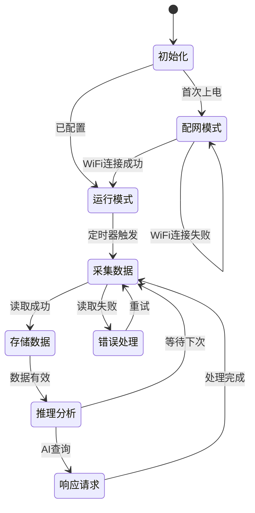

# 情绪感知桌面摆件 - 技术架构文档

## 1. 技术架构总览

### 1.1 系统架构图
```
┌─────────────────────────────────────────────────────────────┐
│                        用户层                                │
│  ┌──────────────┐  ┌──────────────┐  ┌──────────────┐      │
│  │   AI助手     │  │   Web界面    │  │   移动端APP  │      │
│  │  (MCP客户端) │  │              │  │              │      │
│  └──────────────┘  └──────────────┘  └──────────────┘      │
└─────────────────────────────────────────────────────────────┘
                              │
                              │ MCP Protocol
                              ▼
┌─────────────────────────────────────────────────────────────┐
│                      MCP工具层                               │
│  ┌──────────────┐  ┌──────────────┐  ┌──────────────┐      │
│  │environment-  │  │emotion-      │  │insight-      │      │
│  │monitor-mcp   │  │inference-mcp │  │generator-mcp │      │
│  └──────────────┘  └──────────────┘  └──────────────┘      │
└─────────────────────────────────────────────────────────────┘
                              │
                              │ Internal APIs
                              ▼
┌─────────────────────────────────────────────────────────────┐
│                     硬件抽象层                               │
│  ┌──────────────┐  ┌──────────────┐  ┌──────────────┐      │
│  │  传感器接口   │  │   WiFi模块   │  │   存储模块   │      │
│  │ (温湿度/光线) │  │             │  │             │      │
│  └──────────────┘  └──────────────┘  └──────────────┘      │
└─────────────────────────────────────────────────────────────┘
                              │
                              ▼
┌─────────────────────────────────────────────────────────────┐
│                       硬件层                                 │
│  ┌──────────────┐  ┌──────────────┐  ┌──────────────┐      │
│  │ DHT22传感器  │  │  ESP32主控   │  │ 指示灯/屏幕  │      │
│  └──────────────┘  └──────────────┘  └──────────────┘      │
└─────────────────────────────────────────────────────────────┘
```

### 1.2 技术栈选型
- **主控芯片**: ESP32-S3 (WiFi + 蓝牙 + 双核处理器)
- **温湿度传感器**: DHT22 / SHT30
- **环境光传感器**: LDR / BH1750
- **通信协议**: MCP (Model Context Protocol)
- **云端服务**: 天气API (和风天气/心知天气)
- **数据存储**: 本地Flash + 云端SQLite

## 2. MCP工具链详细设计

### 2.1 environment-monitor-mcp
**功能描述**: 环境数据采集与查询

**工具接口**:
```typescript
interface EnvironmentMonitorMCP {
  // 获取当前环境数据
  get_current_environment(): Promise<{
    indoor: {
      temperature: number;    // ℃
      humidity: number;       // %
      light_level: number;    // lux
      timestamp: string;      // ISO时间
    };
    outdoor: {
      weather: string;        // 天气状况
      weather_code: number;   // 天气代码
      temperature: number;    // ℃
      humidity: number;       // %
      wind_speed: number;     // m/s
    };
  }>;

  // 获取历史环境数据
  get_environment_history(
    start_date: string,  // YYYY-MM-DD
    end_date: string     // YYYY-MM-DD
  ): Promise<Array<{
    timestamp: string;
    temperature: number;
    humidity: number;
    light_level: number;
  }>>;

  // 校准传感器
  calibrate_sensor(
    reference_temp: number,
    reference_humidity: number
  ): Promise<{ success: boolean; message: string }>;
}
```

### 2.2 emotion-inference-mcp
**功能描述**: 基于环境数据的情绪状态推断

**工具接口**:
```typescript
interface EmotionInferenceMCP {
  // 推断当前情绪状态
  infer_current_mood(
    environment_data?: {
      temperature: number;
      humidity: number;
      light_level: number;
      weather: string;
    }
  ): Promise<{
    comfort_level: number;     // 1-10 舒适度
    energy_level: number;      // 1-10 活力值
    mood_state: string;        // calm/energetic/tired/irritated
    confidence: number;        // 0-1 置信度
    reasoning: string;         // 推断依据
  }>;

  // 获取情绪建议
  get_mood_suggestions(
    mood_state: string,
    environment_data: object
  ): Promise<Array<{
    type: 'environment' | 'behavior' | 'lifestyle';
    suggestion: string;
    priority: 'high' | 'medium' | 'low';
    reasoning: string;
  }>>;

  // 记录用户情绪反馈
  record_mood_feedback(
    predicted_mood: string,
    actual_mood: string,
    feedback: string
  ): Promise<{ success: boolean; model_updated: boolean }>;
}
```

### 2.3 insight-generator-mcp
**功能描述**: 生成情绪洞察报告

**工具接口**:
```typescript
interface InsightGeneratorMCP {
  // 生成每日洞察
  generate_daily_insight(
    date: string  // YYYY-MM-DD
  ): Promise<{
    date: string;
    overall_mood: string;
    mood_pattern: string;         // "上午精力充沛，下午略显疲惫"
    environment_impact: string;   // "温暖的室内环境有助于保持好心情"
    top_suggestions: Array<{
      time: string;
      suggestion: string;
      category: string;
    }>;
    data_quality: 'good' | 'fair' | 'poor';
  }>;

  // 生成趋势分析
  get_trend_analysis(
    period: 'week' | 'month' | 'quarter'
  ): Promise<{
    period: string;
    mood_trend: 'improving' | 'stable' | 'declining';
    key_insights: string[];
    correlation_findings: Array<{
      factor: string;
      correlation: number;    // -1 到 1
      description: string;
    }>;
    recommendations: string[];
  }>;

  // 导出数据
  export_data(
    start_date: string,
    end_date: string,
    format: 'json' | 'csv'
  ): Promise<{
    download_url: string;
    expires_at: string;
  }>;
}
```

## 3. 硬件方案设计

### 3.1 硬件选型

**主控芯片: ESP32-S3**
- 双核Xtensa LX7处理器，主频240MHz
- WiFi 802.11 b/g/n + 蓝牙5.0
- 34个GPIO引脚，足够扩展
- 低功耗设计，支持睡眠模式
- 成本: ~￥15

**温湿度传感器: SHT30**
- 精度: 温度±0.3℃，湿度±2%RH
- 响应时间: 8秒
- 接口: I2C
- 成本: ~￥8

**环境光传感器: BH1750**
- 量程: 1-65535 lux
- 精度: ±20%
- 接口: I2C
- 成本: ~￥3

**显示屏: 0.96寸OLED**
- 分辨率: 128x64
- 接口: I2C
- 成本: ~￥5

**预估总成本**: ~￥35-50

### 3.2 硬件电路设计
```
ESP32-S3
├── GPIO 21 (SDA) ──┬── SHT30 (温湿度)
├── GPIO 22 (SCL) ──┤
│                  └── BH1750 (光照)
├── GPIO 4 ──────── OLED (显示屏)
├── GPIO 2 ──────── LED指示灯
└── 3.3V & GND ───── 电源和地
```

### 3.3 外观设计
- **尺寸**: 6cm x 6cm x 8cm (立方体)
- **材质**: 木质外壳 + 透明亚克力面板
- **颜色**: 原木色/白色
- **指示**: 顶部LED环形灯带，颜色表示状态
  - 绿色: 舒适
  - 黄色: 一般
  - 红色: 不舒适

## 4. 软件架构设计

### 4.1 固件架构
```
src/
├── main.cpp              // 主程序
├── config/
│   ├── wifi_config.h     // WiFi配置
│   └── mcp_config.h      // MCP配置
├── sensors/
│   ├── dht_sensor.h      // 温湿度传感器
│   └── light_sensor.h    // 光照传感器
├── mcp/
│   ├── mcp_server.h      // MCP服务器
│   └── tools/            // MCP工具实现
├── wifi/
│   └── wifi_manager.h    // WiFi管理
├── storage/
│   └── data_manager.h    // 数据存储
└── utils/
    ├── json_helper.h     // JSON工具
    └── logger.h          // 日志工具
```

### 4.2 状态机设计


### 4.3 内存管理
- **Flash存储**: 4MB
  - 固件: 1MB
  - 用户配置: 100KB
  - 数据缓存: 2.9MB (可存储6个月数据)
- **RAM**: 512KB
  - 运行时: 200KB
  - 数据缓存: 312KB

## 5. 数据流程设计

### 5.1 数据采集流程
```
传感器数据 → 主控读取 → 数据验证 → 本地存储 → 云端同步
     ↓           ↓          ↓          ↓          ↓
   5分钟      500ms      100ms      100ms      异步
```

### 5.2 MCP工具调用流程
```
AI助手请求 → MCP服务器 → 工具选择 → 数据处理 → 响应返回
     ↓          ↓          ↓          ↓          ↓
  解析请求   路由分发   执行逻辑   格式化   JSON响应
```

### 5.3 情绪推断算法
```
输入特征:
- 温度 (weight: 0.3)
- 湿度 (weight: 0.2)
- 光照 (weight: 0.2)
- 天气 (weight: 0.3)

计算公式:
comfort = 1 - (
  |temp - 24| / 20 * 0.3 +
  |humid - 50| / 50 * 0.2 +
  |light - 400| / 1000 * 0.2 +
  weather_penalty * 0.3
)

mood_state =
  comfort > 0.7 → calm
  comfort > 0.4 → neutral
  else → uncomfortable
```

## 6. 部署方案

### 6.1 开发环境
- **IDE**: Arduino IDE / PlatformIO
- **框架**: ESP-IDF v4.4+
- **调试**: 串口调试 + JTAG仿真器
- **测试**: 单元测试 + 集成测试

### 6.2 生产部署
- **OTA更新**: 支持无线固件升级
- **配置管理**: WiFi参数云端配置
- **监控**: 设备状态云端监控
- **日志**: 错误日志云端上报

## 7. 性能优化

### 7.1 功耗优化
- **深度睡眠**: 空闲时进入深度睡眠模式
- **传感器采样**: 按需采样，非连续采样
- **WiFi管理**: 批量上传数据，减少连接次数
- **目标功耗**: 平均<1mA (待机)

### 7.2 响应速度优化
- **数据缓存**: 本地缓存最近24小时数据
- **预加载**: 启动时预加载必要数据
- **并发处理**: 传感器读取与网络请求并发
- **目标响应**: MCP调用<500ms

### 7.3 存储优化
- **数据压缩**: 浮点数压缩存储
- **环形缓冲**: 固定大小循环存储
- **定期清理**: 超过6个月数据自动清理
- **容量规划**: 4MB Flash存储6个月数据

## 8. 安全设计

### 8.1 通信安全
- **HTTPS**: 云端通信使用HTTPS
- **证书验证**: 防止中间人攻击
- **API密钥**: 天气API密钥加密存储

### 8.2 数据安全
- **本地加密**: 敏感数据本地加密存储
- **访问控制**: MCP工具访问权限控制
- **数据脱敏**: 云端存储用户ID脱敏

## 9. 测试方案

### 9.1 硬件测试
- **传感器精度测试**: 与标准仪器对比
- **长期稳定性测试**: 连续工作30天
- **环境适应性测试**: 高温、低温、高湿环境

### 9.2 软件测试
- **单元测试**: 传感器读取、算法逻辑
- **集成测试**: MCP工具完整流程
- **性能测试**: 响应时间、内存使用
- **压力测试**: 连续请求、高并发

### 9.3 用户测试
- **可用性测试**: 用户操作流程
- **准确性验证**: 情绪推断准确度
- **反馈收集**: 用户体验优化

## 10. 开发计划

### Phase 1: 原型开发 (2周)
- [ ] 硬件选型与采购
- [ ] 基础传感器读取
- [ ] WiFi连接与数据传输

### Phase 2: MCP工具开发 (3周)
- [ ] 环境监测MCP工具
- [ ] 情绪推断MCP工具
- [ ] 洞察生成MCP工具

### Phase 3: 算法优化 (2周)
- [ ] 情绪推断算法调优
- [ ] 个性化学习机制
- [ ] 准确度验证

### Phase 4: 产品化 (3周)
- [ ] 外观设计优化
- [ ] 用户界面开发
- [ ] 稳定性测试

## 11. 技术风险与应对

### 11.1 传感器精度风险
- **风险**: 温湿度传感器精度不足
- **应对**: 选择工业级传感器，增加校准机制

### 11.2 硬件成本风险
- **风险**: 硬件成本过高影响商业化
- **应对**: 优化设计，选择性价比更高的替代方案

### 11.3 算法准确度风险
- **风险**: 情绪推断准确度不够
- **应对**: 引入多维度验证，持续优化算法

## 12. 参考资料

### 12.1 技术文档
- ESP32-S3官方文档: https://docs.espressif.com/
- MCP协议规范: https://modelcontextprotocol.io/
- SHT30数据手册

### 12.2 开源项目
- ESP32-MCP-Server: 参考实现
- 情绪分析算法: 相关学术论文

### 12.3 API文档
- 和风天气API
- 心知天气API
